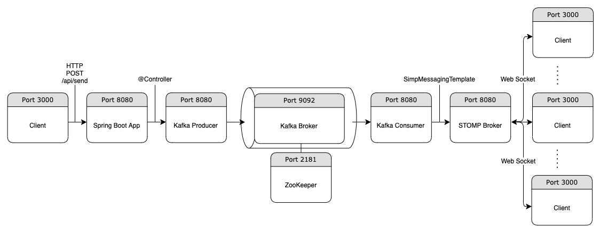

# kafka-real-time-chat
## Summary
> Built and published Real time Chat Microservice which uses Kafka as data pipeline 
> Used Java, Spring Boot, Kafka, STOMP over WebSocket

## Structure
 

## How to run project
> 1st. Run Kafka  
&nbsp;&nbsp;&nbsp;&nbsp;Inside the bin directory in your Kafka directory, 
&nbsp;&nbsp;&nbsp;&nbsp;./zookeeper-server-start.sh ../config/zookeeper.properties 
&nbsp;&nbsp;&nbsp;&nbsp;./kafka-server-start.sh ../config/server.properties 
&nbsp;&nbsp;&nbsp;&nbsp;./kafka-topics.sh --create --topic kafka-chat -zookeeper localhost:2181 --replication-factor 1 --partitions 1  
> 2nd. Run Kafka real time chat application  
&nbsp;&nbsp;&nbsp;&nbsp;mvn spring-boot:run  
> 3rd. Run Client 
&nbsp;&nbsp;&nbsp;&nbsp;Inside the chat-ui directory, 
&nbsp;&nbsp;&nbsp;&nbsp;npm start

